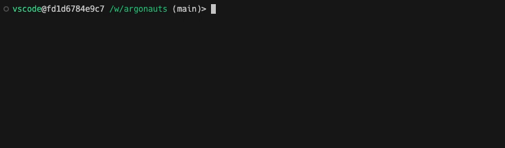

<div align="center">

  # ARGONAUTS 🧑🏽‍🚀

  [](https://badge.fury.io/py/argonauts)
  [](https://opensource.org/licenses/MIT)
  [](https://pypi.org/project/argonauts/)


---

Argonauts is a Python library that transforms your functions into interactive command-line interfaces with ease. Using simple decorators, you can create engaging CLI experiences without the hassle of manual argument parsing.



</div>

## 🚀 Features

- Transform functions into interactive CLIs with a single decorator
- Automatic type inference and validation
- Chainable interactive functions

## 📦 Installation

Install Argonauts using pip:

```bash
pip install argonauts
```

Install from source:

```bash
git clone <repo-url>
cd argonauts
pip install .
```

## 🛠 Usage

### Basic Usage

Here's a simple example of how to use Argonaut:

```python
from argonauts import argonaut
from enum import Enum

class PizzaSize(Enum):
    SMALL = "Small"
    MEDIUM = "Medium"
    LARGE = "Large"

class Topping(Enum):
    PEPPERONI = "Pepperoni"
    MUSHROOMS = "Mushrooms"
    ONIONS = "Onions"
    SAUSAGE = "Sausage"
    BELL_PEPPERS = "Bell Peppers"


@argonaut(process_name="We are making your pizza! Keep calm!")
def order_pizza(
    size: PizzaSize,
    toppings: list[Topping],
    extra_cheese: bool = False,
    delivery: bool = True,
):
    """Order a delicious pizza with your favorite toppings."""
    pizza = f"{size.value} pizza with {', '.join(t.value for t in toppings)}"
    if extra_cheese:
        pizza += " and extra cheese"
    print(f"You've ordered: {pizza}")

    time.sleep(20)  # Simulate making the pizza

    if delivery:
        print("Your pizza will be delivered soon!")
    else:
        print("Your pizza is ready for pickup!")

order_pizza()
```

### Chaining Interactive Functions

Argonauts allows you to chain multiple interactive functions with the ability to share the previous arguments:

```python
from argonauts import argonaut, LogBook

args = LogBook()

@argonaut(logbook=args)
def select_movie(title: str, genre: str):
    rating = some_fn_to_get_rating(title)
    return {"title": title, "rating": rating}

@argonaut(logbook=args, include_params=["popcorn", "drinks"]) # Include only the specified parameters
def select_snacks(movie: dict, genre: str, popcorn: bool, drinks: list[Drinks]):
    print(f"Watching {args.title} ({movie['rating']} stars)") # Reuse the title argument
    print("Genre:", genre)
    if popcorn:
        print("- Popcorn")
    print(f"- Drinks: {', '.join(drinks)}")

def movie_night():
    movie = select_movie()
    select_snacks(movie=movie, genre=args.genre) # Reuse the genre argument

movie_night()
```


## 🤝 Contributing

We welcome contributions! Please see our [Contributing Guide](CONTRIBUTING.md) for more details.

## 📄 License

Argonauts is released under the MIT License. See the [LICENSE](LICENSE) file for details.

## 🙏 Acknowledgements

- [Questionary](https://github.com/tmbo/questionary) for providing an excellent prompt library
- [Rich](https://github.com/Textualize/rich) for beautiful and interactive terminal output

---

<div align="right">
  Made with ❤️ for the Developers by the Developers
</div>